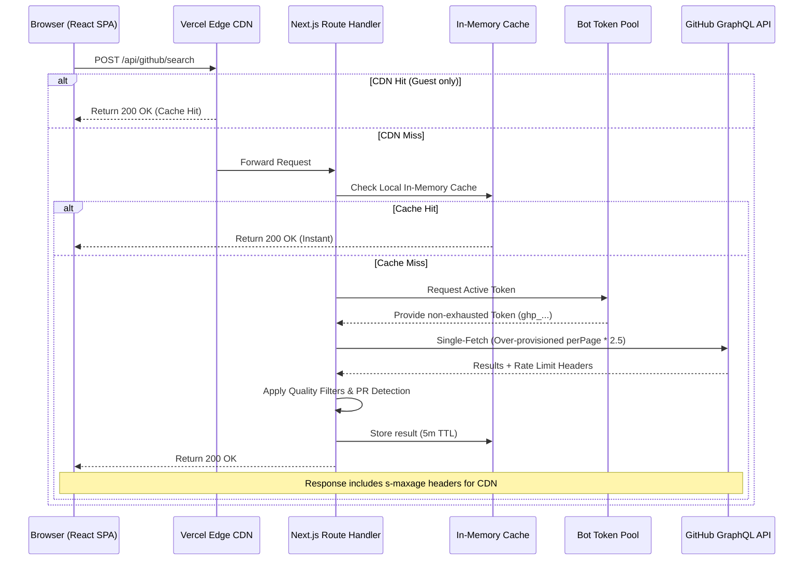

# Architecture Deep Dive (Performance v2)

> This document describes the high-performance architecture implemented for the GitTrek launch. It covers the transition from sequential looping to single-fetch optimization, token rotation, and multi-layer caching.

---

## 🚀 High-Level Data Flow (v2)



---

## ⚡ Search Engine Optimization (v2)

### 1. Single-Fetch + Over-provisioning
The previous "Sequential Loop" architecture (V1) was the #1 cause of latency. It called the GitHub API up to 3 times in a row, leading to 12–15s wait times.

**V2 Strategy:**
Instead of looping, we make **exactly one** GraphQL request. We request more items than needed (typically `perPage * 2.5`, capped at 50) and apply quality filters on that single batch.
- **Latency:** 12–15s → **3–4s**.
- **Rate Limit Cost:** ~75 pts → **~25 pts**.
- **Trade-off:** Occasionally fewer results than requested if many fail filters. Acceptable for the speed gain.

### 2. Exhaustion-Aware Token Pool
To protect the app from being rate-limited by guests, we use a rotation of Personal Access Tokens (PATs).
- **Format:** `GITHUB_BOT_TOKEN="tok1,tok2,tok3"` (comma-separated).
- **Rotation Logic:** Not naive round-robin. It uses a token until GitHub returns a `429` or `403`. It then marks that token as "exhausted" until the specific `resetAt` time provided by GitHub's headers and moves to the next available token.
- **Capacity:** Each additional token adds **+5,000 pts/hour** capacity (~200 guest searches).

### 3. Multi-Layer Caching
We implement three distinct caching layers to ensure the best possible performance:

| Layer | Implementation | Target | Benefit |
|---|---|---|---|
| **Client Cache** | TanStack Query | Repeat views for same user | Instant navigation (0ms) |
| **Instance Cache** | In-Memory `Map` | Same query across users on same node | Instant response (10ms) |
| **Global CDN** | Vercel Edge Cache | Guests globally | Geographic speed + 0 API cost |

---

## 📊 Vercel Integration

### Vercel Analytics
We use `@vercel/analytics` to track real-user performance and traffic patterns.
- **Zero-Config:** Automatically pulls project IDs from the Vercel environment.
- **Metrics:** Page views, unique visitors, Top Countries, and Web Vitals (LCP, FID, CLS).

### Edge CDN (Fix D)
Search results for **Guest Users** include the following header:
`Cache-Control: public, s-maxage=300, stale-while-revalidate=600`
- **s-maxage=300:** CDN caches for 5 minutes.
- **stale-while-revalidate:** Allows serving old results for an extra 10 minutes while updating in the background.

---

## Component Hierarchy (Updated)

```
src/
├── app/
│   ├── api/github/search/
│   │   └── route.ts        # The main search engine (cached & pool-aware)
│   └── layout.tsx          # Includes <Analytics />
├── lib/
│   └── github/
│       ├── search.ts       # Query compiler & quality filters
│       └── token-pool.ts   # The rotation logic (NEW)
└── components/
    ├── HomeClient.tsx      # Gated loading states to prevent hydration bugs
    └── FilterPanel.tsx     # Fully accessible (ARIA compliant) controls
```

---

## Updated Performance Decisions

| Decision | Reason |
|---|---|
| **Eliminate Loop** | Loop was the primary bottleneck. Single-fetch is 4x faster. |
| **Token Rotation** | Moves guest search capacity from "limited" to "horizontally scalable". |
| **Hydration Gating** | Prevents "Flash of Unstyled Content" and React hydration errors on slow mounts. |
| **CDN Offloading** | Popular searches (like "good first issue") cost 0 GitHub points after the first hit. |
| **Mutable Filter Copy** | Fixed a bug where Zod read-only objects were blocking runtime modifications. |
