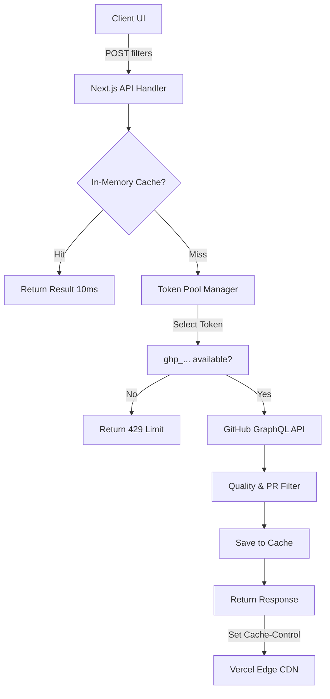

# System Design (Updated v2)

> This document describes the data flow, API design, rate limiting strategy, and key trade-offs in GitTrek's high-performance search engine.

---

## High-Level Data Flow (v2)

---

## Scalability & Rate Limiting Strategy

### The Guest Search Problem
GitTrek's "Guest Mode" uses a shared set of Personal Access Tokens (PATs). A single PAT only provides 5,000 GraphQL points per hour, which equates to roughly 50–100 sequential-loop searches.

### Solution: Token Pool Rotation
We implemented an **Exhaustion-Aware Token Pool** (`src/lib/github/token-pool.ts`).
1.  **Multiple Tokens**: Supports N tokens in a comma-separated env var.
2.  **Exhaustion Tracking**: Instead of simple round-robin, it uses a token until it receives a real `429` from GitHub.
3.  **Cooldown Period**: When a token is exhausted, the system reads the `x-ratelimit-reset` header and puts that token on "cooldown" until exactly that timestamp.
4.  **Transparent Retry**: If Token A fails with a rate limit error, the API handler immediately retries with Token B before responding to the user.

### Per-IP Rate Limiting
To prevent abuse of the token pool, guest users are also limited by a local per-IP rate limiter (10 searches/min). Auth users skip this check as they use their own private GitHub tokens.

---

## Caching Hierarchy (V2)

Contrary to earlier design phases, GitTrek now employs a 3-layer caching strategy:

1.  **Browser Cache (TanStack Query)**:
    - **Scope**: Local to the user's browser.
    - **Duration**: 15 minutes.
    - **Purpose**: Prevents re-fetching when toggling views or going back/forward in pagination.

2.  **Server Instance Cache (In-Memory)**:
    - **Scope**: Local to a warm Vercel function instance.
    - **Duration**: 5 minutes.
    - **Purpose**: If multiple users search for the same thing (e.g., "React good first issues") at the same time, only one call hits GitHub.

3.  **Edge CDN Cache (Vercel Global)**:
    - **Scope**: Global (Vercel's Edge Network).
    - **Duration**: 5 minutes (s-maxage=300).
    - **Purpose**: Offloads repeat guest traffic entirely. The search request never even reaches the GitTrek server.

---

## API Design & Trade-offs

### Single-Fetch vs Sequential Loops
**V1 (Sequential Loops)**:
- Logic: Fetch 100 → Filter → If < 20 results → Fetch 100 more.
- Pros: Always returns exactly 20 items.
- Cons: 15s latency, high rate limit cost.

**V2 (Single-Fetch - CURRENT)**:
- Logic: Fetch 50 items (2.5x over-provision) once.
- Pros: 3s latency, 3x cheaper on rate limits.
- Cons: Might return 12-15 items instead of 20 on rare occasions.
- **Decision**: Speed is the priority for launch.

### Why POST for Search?
The filter payload is complex. Using POST:
1.  Avoids URL length limits.
2.  Allows for cleaner `application/json` bodies.
3.  Prevents search parameters from polluting browser history.
4.  **Caveat**: Since it's a POST, browsers don't cache it by default. We manually enabled caching using `Cache-Control` headers, which Vercel's CDN respects even for POST requests (when configured correctly).

---

## Error Handling v2

| Error | Handling Logic |
|---|---|
| **Rate Limit (Partial)** | Token Pool retries with next token immediately. |
| **Rate Limit (Full)** | Returns 429 with "Sign in to GitHub" suggestion. |
| **Hydration Mismatch** | Component gates rendering on `mounted` state; server always renders skeleton. |
| **Zod Validation** | Returns 400 with field-specific errors. |
| **GitHub Down** | Returns 500 with friendly "Network issue" message. |
